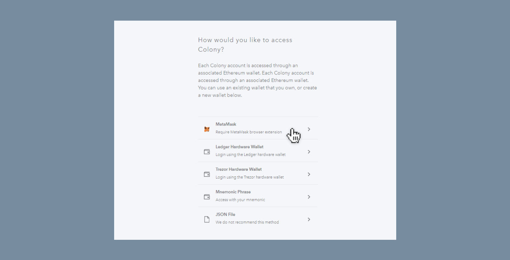

To create a Colony account, you will need an [Ethereum address]() and some [Ether]() to pay your transaction fees.
([Why are there transaction fees?]())

Once you have an Ethereum address and some Ether, creating your Colony account is simple.
No email address and password are needed, simply authenticate with your Ethereum wallet and you are in!

