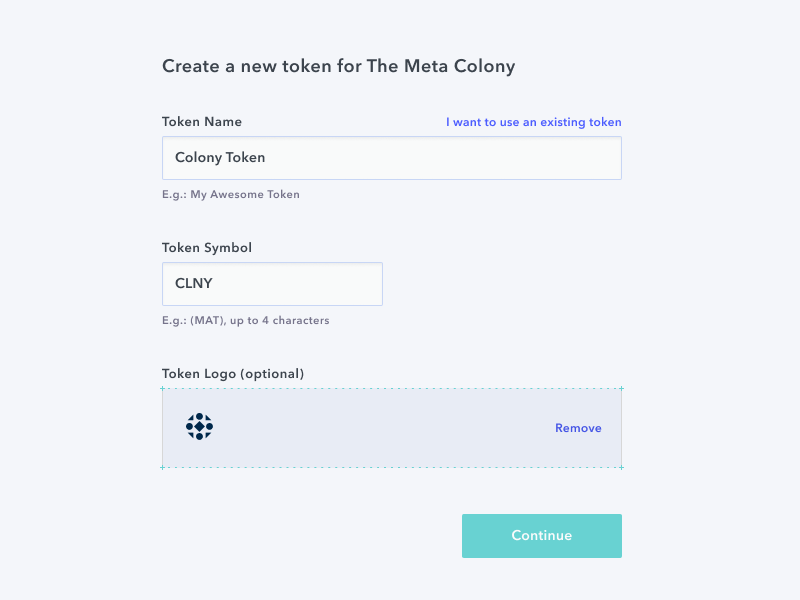
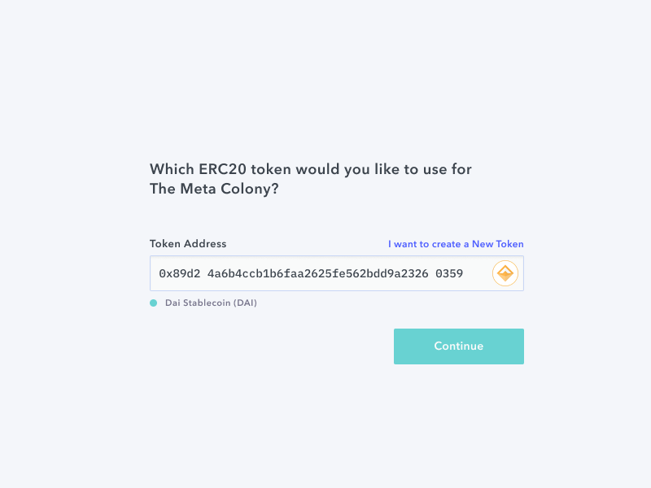

Picking the right native token is one of the most important decisions that you need to make when you set up your colony.

Sending native tokens is how your colony distributes reputation.

Once you have selected the native token, it cannot be changed.

As such, it is important that you understand the potential implications of different choices.

You have two options when picking a native token, each with their own benefits and considerations; create a token or bring your own token

## Create a new token
**Benefit**

Easily gives your colony the ability to mint new tokens and to define how and why they are valuable.

**Considerations**

You will need to define why the token is valuable; how, when, and why is it distributed and at what rate? This will determine how reputation in your colony is earned.

## Bring your own token (BYOT)
**Benefit**

Your colony’s reputation is pegged to an existing token, that (presumably) has an economic model. For example, if you choose DAI, reputation in your colony is a reflection of the US dollar value that the colony has been willing to pay you; a good proxy for how valuable your contributions are to the colony.

**Considerations**

Your colony’s reputation is exposed to the risks and fluctuations of whichever token you choose. This is compounded if you select a native token that you do not control, like DAI for example.

