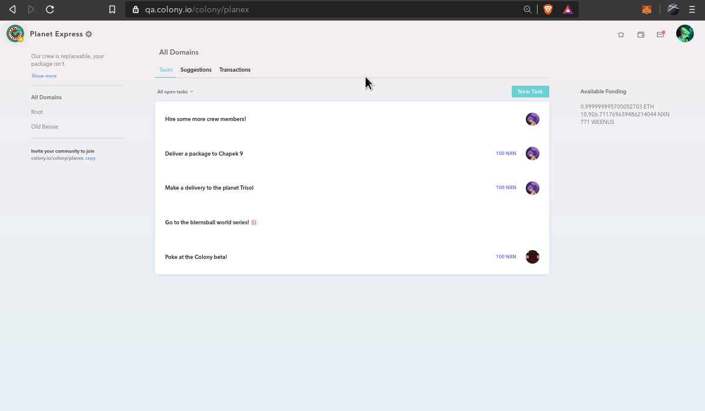

Navigate to your colony’s dashboard and click the **settings icon** ⚙ next to your colony’s name.

In the **profile** tab, you will find your colony’s address. Send Ether and/or ERC20 tokens to this address to fund your colony.

Before the tokens show up in your colony’s wallet, you will need to claim the incoming transactions from the **Transactions** tab.

Once you have claimed your tokens, you your colony's token balances will be updated.

