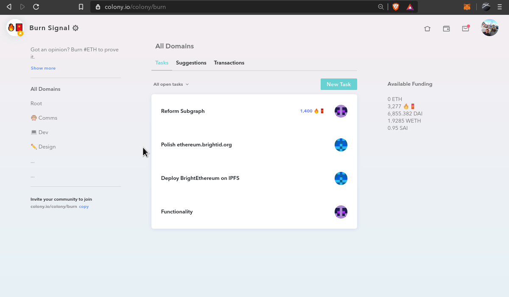

By default, your colony's native tokens are non-transferable.

The colony founder can unlock your colony's native token to make them transferable.

**But beware; what is done, cannot be undone.**
Once you unlock your colony's native token, they cannot be locked again in future.

To unlock your colony's native token, click on the Settings icon ⚙ on your colony's home page.

Click the **Advanced** tab.

Click **Unlock Token**.

Click **Confirm**.

Yay! Now your token is unlocked and people can send it freely! 🎉

