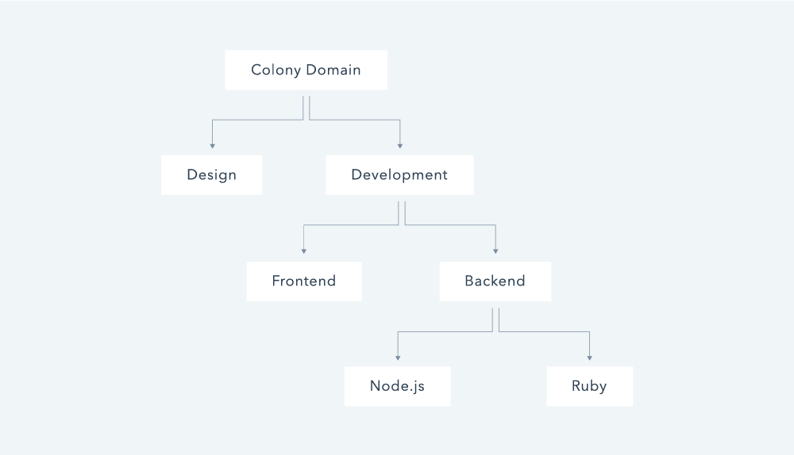

Domains make up the internal organizational structure of a colony. Similar to the file system on your computer, each Domain is like a folder. In the same way that a folder contains files and subfolders, a Domain can contain tasks, payments, and subdomains.

Aside from keeping everything neat and tidy, Domains serve two important functions:

1. They allow for [domain-specific permissions](what-are-permissions.md), which let you granularly define which accounts have which permissions throughout the colony.

2. They make Reputation more contextual by awarding Reputation in a specific Domain (and all of its parent domains) rather than globally throughout the colony.
